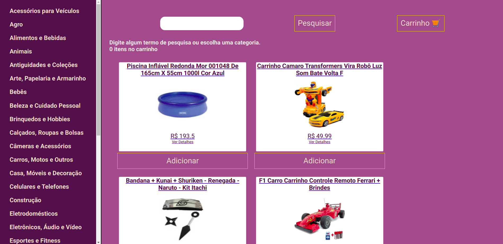
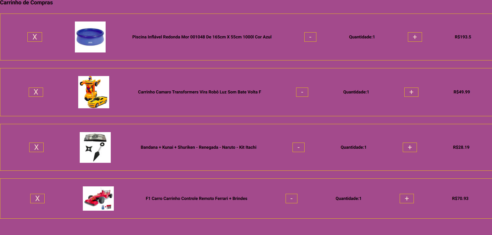
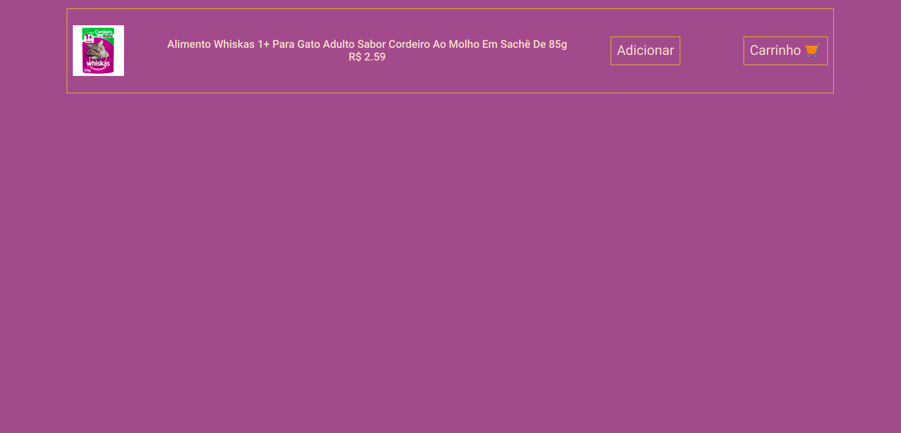

<header>
  <h1>PROJETO FRONT-END ONLINE STORE</h1>  
    
Desenvolvido em ReactJS, o projeto foi feito em grupo para por em prática métodos ágeis, Kanban e Scrum, e para aprimorarmos nossos conhecimentos em Front-End

     
     
    <a href="https://github.com/tryber/sd-011-project-frontend-online-store/tree/main-group-15">BRANCH ORIGINAL</a>
</header>

##

<main>
  <h2>O QUE FOI DESENVOLVIDO</h2>
  
O Front-End Online Store foi feito utilizando ReactJS, nele foi proposto utilizarmos props para passar informações entre os componenetes. Isso ocorreu para entendermos o problema que isso gera e a razão pela qual se utilizar Redux e Context.

  
Nele é possível buscar qualquer coisa disponível no Mercado Livre. Também é possível filtrar por categorias, ver alguns detalhes e adicionar itens ao carrinho.

  
A base de dados é a API do Mercado Livre.

  
  
O layout tem como foco web browser.

</main>

<section>
  <h3>API UTILIZADA</h3>
    <ul>
      <li><a href="https://developers.mercadolivre.com.br/pt_br/api-docs-pt-br">Mercado Livre API</a></li>
    </ul>
</section>

<section>
  <h3>COMO RODAR O FRONT-END ONLINE STORE</h3>
  <ol>
    <li>Clone o repositório.</li>
    <li>Na raiz do projeto utilize o comando <b>npm install</b>.</li>
    <li>Agora utilize o comando <b>npm start</b>.</li>
  </ol>
</section>

##

<section>
  <h3>PESSOAS DESENVOLVEDORAS:</h2>
    <ul>
      <li>
      <a href="https://github.com/gab-boff">Gabriel Boff</a>
      </li>
      <li>
      <a href="https://github.com/laissimenikim">Lais Simenikim</a>
      </li>
      <li>
      <a href="https://github.com/nalumelo">Nalu Melo</a>
      </li>
      <li>
      <a href="https://github.com/Zeonnatios">Matheus Antonio</a>
      </li>
    </ul>
</section>

<section>
  <h2>CONSIDERAÇÃO FINAL</h2>
  
Este projeto foi criado apenas por razões didáticas, sem nenhum objetivo além desse.

</section>